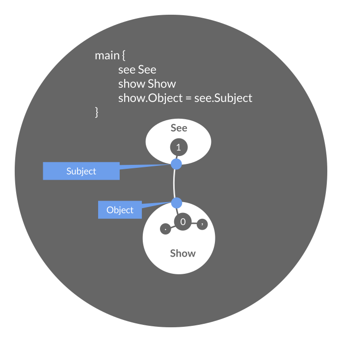

# [Escher - A language for programming in pure metaphors](http://escher.io)

[](https://travis-ci.org/gocircuit/escher)
[](https://godoc.org/github.com/gocircuit/escher)
[](https://goreportcard.com/report/github.com/hoijui/escher)

___NOTE___ _Escher (in this repository) is stagnant since 2015_

See [the projects website](http://escher.io)
for more info about the language.

Enclosed | Enclosing
--- | ---
 |  
Discrete | Continuous

Escher is a programming language for everything.
It can naturally represent both process and data,
while being simpler than a calculator grammar.

Escher is a language for building intelligent real-time translations between the semantics of
different physical devices accessible through chains or networks of digital or electrical technologies.

In Escher, you can program from first- and third-person point-of-view at the same time;
just like Physics is particles and waves at the same time.

An early "proposal" for the design of Escher,
[Escher: A black-and-white language for data and process representation](http://www.maymounkov.org/memex/abstract),
might be an informative (but not necessary) read for the theoretically inclined.

## Application domains

Anything that filters information from some input sources, in real-time,
and sends a transformed form to output devices.

* Definition and generation of _synthetic worlds_ governed by Physical laws,
  as in Augmented Reality and the Gaming Industry
* _General purpose concurrent and distributed programming_,
  such as Internet services and cloud applications
* _Relational data representation_, as in databases and CAD file formats
* _Real-time control loops_, as in Robotics
* Numerical and scientific computation pipelines
* ...

## Computational Model

___Attention:___ _Non-Turing Mathematics ahead_

The Escher abstraction of the world is NOT Turing-compatible:
From the point-of-view of an Escher program,
there is no input and output:
There are only emergences and disappearances of events.

Escher presents the world in a model called
[Choiceless Computation](http://arxiv.org/pdf/math/9705225.pdf).

Understanding the difference between _Turing Machines_ and _Choiceless Computation_,
while not entirely necessary, sheds much light on the profound difference between
Escher and other languages.
The relevant publications are quoted in the [bibliography](#bibliography) at the end.

### Choiceless Programming by example

The following puzzle demonstrates choiceless programming via a simple, relatable high-school
Math puzzle:

---

Four beer caps are placed on the corners of a square table with arbitrary orientations.
There is a robot on the table that acts upon three commands:

1. flip a corner cap
2. flip two diagonal caps
3. flip two caps along a side

Upon action there is no guarantee as to which corner, diagonal
or side, respectively, the robot will choose to flip.

Devise a sequence of commands that forces the robot to turn all caps in a
configuration where they all have the same orientation.

Can you devise a sequence that ensures they all face up? Down?

---

This is a great introduction to the notion of choiceless programming.

## Quick start

Escher is an interpreter comprising a singular executable binary.
It is written in [Go](http://golang.org),
and can be built for Linux, OSX and Windows.

Given that the [Go Language compiler is installed](http://golang.org/doc/install),
you can build and install the circuit binary with one line:

```bash
go get github.com/gocircuit/escher/escher
```

Go to the Escher base directory and run one of the tutorials

```bash
cd $GOPATH/src/github.com/gocircuit/escher
escher -src src/tutorial "*helloworld.escher"
```

## Structure

Please reffer to [the projects website](http://escher.io).

## Syntax (files) and faculties (directories) structure

Escher programs are designated by a local root directory and all its descendants.
That directory is represented as the root in the faculty name-space
inside the Escher programming environment.

Escher compiles all files ending in `.escher` and attaches the resulting circuit designs
to the name-spaces corresponding to their directory parents.

To materialize (i.e. run) an Escher program, use the mandatory `-x` flag
to specify the path to the local source directory.

```bash
escher -x tutorial/helloworld
```

Escher materializes the circuit design named `main` in the root source directory, e.g.

```escher
// The main circuit is always the one materialized (executed).
main {
	s @show
	s.Action = "¡Hello, world!"
}
```

### Recombining programs

To facilitate different embodiments (aka implementations) of gate functionalities,
Escher allows the mixing of two source hierarchies into a single execution.

For instance, the hierarchy `acid/karajan` contains circuit definitions
(in terms of gates or other circuits),
while the hierarchy `tutorial/circuit/autorespawn` contains a root `main` circuit.
To execute the latter, using the former as a "library" available in the visible name-space,
run for instance

```bash
escher \
	-x tutorial/circuit/autorespawn \
	-y acid/karajan \
	-n ExecutionName \
	-s Server=Xa3242440007ad57b \
	-d 228.8.8.8:22
```


## Basic gates

By default, the Escher environment provides a basic set of gates (a basis),
which enable a rich (infinite) language of possibilities in data manipulation.

Collectively, they are data (concept) and transformation (sentence) gates.

These gates are not part of Escher's semantics.
They are merely an optional library — a playground for beginners.
Users can implement their own gates for data and transformation.

The basis reference below is nearly entirely visual.
You will notice that the visual language follows a prescribed format.

### Data (Noun) gates

On blank slate, there is "nothing to do" -- so to speak.
For this reason, we have a collection of gates which are effectively "springs" of objects.

Some produce integers, some floats, some complex numbers, some strings.
These are familiar types.

There is one gate that produces "trees".
Trees are the basic type of "weavable" (or mutable) knowledge.
(In fact, the other types are not necessary, but we throw them in for convenience.)

In the illustration below, the syntax of the respective gate design is displayed
as their name (white on black).


### Combinator (Manipulator) gates


### Arithmetic (Applying) gates

Arithmetic gates are a sufficient basis of operations that enables
algorithmic manipulation of the types string, int, float and complex.
_TODO_.

### Tree of Knowledge and the Reason (Learning) Gate

You will notice, one of the basic data gates allows the creation of a struct-like object.
This is called a _tree_.
It is a novel data structure, described in detail in
["Extensible records with scoped labels" by Daan Leijen](http://research.microsoft.com/pubs/65409/scopedlabels.pdf).

These data structures are "built out" and "trimmed down" using three elegant
reflection methods, described in the above publication.

Escher embodies all three in one gate,
whose main purpose is to manipulate the contents of trees.
This is the _Reason Gate_, illustrated below.

The following three illustrations show the same gate design,
but under different orientations of the event streams.
In all valid cases, the relationship between the valve values shown,
exemplifies the effect of the gate.


> Belief for the current state of the world,
  combined with a new observation,
  results in a theory.


> A theory of observations, which explains (includes) an observation at hand,
  explains the observation only to a belief consisting of the theory without the observation.


> When a belief of the state of the world is combined with a theory that is bigger,
  the conjectured difference must be found in a new observation.

## Duality gates

Duality gates are the boundary between Escher semantics and the outside world.
They are the I/O with the outside.
Such gates affect some external technology when prompted through Escher in a certain way.
Alternatively, such gates might fire an Escher message on one of its valves,
in response to an asynchronous events occurring in an external technology.

### Variation (Surprise) and Causation (Action) gates


For instance, with the gates we've seen so far,
one might construct the following higher-level circuit abstraction for an I/O device,
which is controlled by a deferred logic:


And the respective source code:

```escher
io_device {
	// recalls
	in see
	out show
	swtch switch
	// matchings
	Logic = swtch.Socialize
	in.Sensation = swtch.Hear
	out.Action = swtch.Speak
}
```

## Introspective and extrospective gates

This special type of gates fulfills the complementary functions
of constructing new circuit designs "dynamically"
(akin to "reflection" in other languages),
and materializing (i.e. executing) these designs.

_TODO_

### The Julia (Exploiting) Gate

_TODO_

### The Escher (Einstein) Gate: Multiple foci over Space and Time

_TODO_

## The future collapsed

_TODO_

## Why you should be excited

It may seem that Escher is not more than a new semantic to do an old job.
But something nearly magical happens when transition to using the
Escher semantic—various compiler intelligence improvements that
used to be NP-hard become simple and tractable:

* Users do not need to explicitly moduralize (sub-divide) their circuits.
  One could start designing a circuit wiring and the compiler will automatically
  find sub-patterns that are abstractable as circuits.
  Which includes non-obvious and/or recursive ones.

* Code speed/space/etc optimizations reduce to a simple sub-graph replacement game,
  highly transparent to and customizable by the user.

## Misc

A reference to the
[initial](http://www.maymounkov.org/chomsky-valiant-algorithmic-mirror)
[thoughts](http://www.maymounkov.org/puzzle-test-turing-test)
that led to the invention of Escher.

To the original author,
Escher is a language for weaving dreams:

It makes imagination real.

Help make it tangible, so it can be shared.

## Sponsors and credits

* [DARPA XDATA](http://www.darpa.mil/Our_Work/I2O/Programs/XDATA.aspx)
  initiative under the program management of
  [Dr. Christopher White](http://www.darpa.mil/Our_Work/I2O/Personnel/Dr_Christopher_White.aspx), 2013–2014
* [Data Tactics Corp](http://www.data-tactics.com/), 2013–2014
* [L3](http://www.l-3com.com/), 2014

## Bibliography

* [Choiceless Polynomial Time](http://arxiv.org/pdf/math/9705225.pdf),
  [Andreas Blass](http://www.math.lsa.umich.edu/~ablass/),
  [Yuri Gurevich](http://research.microsoft.com/en-us/um/people/gurevich/) and
  [Saharon Shelah](http://shelah.logic.at/), published by Shelah Office
  on [arXiv](http://arxiv.org/abs/math/9705225), 1997

* [Choiceless Polynomial Time Logic: Inability to Express](http://link.springer.com/chapter/10.1007%2F3-540-44622-2_6),
  [Saharon Shelah](http://shelah.logic.at/), Springer Lecture Notes in Computer Science, Volume 1862, 2000, pp. 72-125

* [Circuits of the Mind](http://www.amazon.com/Circuits-Mind-Leslie-G-Valiant/dp/0195126688), Leslie Valiant, 2000
* [Probably Approximately Correct, 53589083](http://www.probablyapproximatelycorrect.com/), Leslie Valiant, 2013

Additional, enlightening reading includes:

* [Ancient Evenings](http://en.wikipedia.org/wiki/Ancient_Evenings), Norman Mailer, 1983
* [Yoga Philosophy of Patañjali](http://www.amazon.com/Yoga-Philosophy-Patanjali-Translation-Annotations/dp/0873957296),
  State University of New York Press, 1984
* [Samskrta-Subodhini: A Sanskrit Primer](http://www.amazon.com/Samskrta-Subodhini-Sanskrit-Primer-Michigan-Southeast/dp/089148079X),
  Michigan Papers on South and Southeast Asia, Book 47, 1999

People working in this or unsuspectingly related areas:

* [Steven Witten](http://acko.net/about/) and [Kyle McDonald](http://kylemcdonald.net/) for heroic
  attempts at fluidity in digital art.

* [Bret Victor](http://worrydream.com/#!2/LadderOfAbstraction) for the insight that inventing a
  good user interface and reverse-engineering the mind is one and the same thing.

* [Noam Chomsky](https://www.youtube.com/watch?v=bfSyWRvoYfw) for suggesting
  that discrepancies in language vs action are a window into the producing device, as well as
  the circularity of the meaning of languages.

* [John Conway](http://en.wikipedia.org/wiki/John_Horton_Conway)
  for the [Symmetries of Things](http://www.amazon.com/The-Symmetries-Things-John-Conway/dp/1568812205).

* [Daniel Spielman](http://www.cs.yale.edu/homes/spielman/precon/precon.html)
  for the insight that general linear systems will never be invertible in linear time,
  because there are no naturally linguistically-posable problems that can result in such matrices.
  As well as the insight that even circular objects (like general undirected graphs)
  have to be intellectually broken down to "simple" trees (via the notion of “distribution of trees”)
  in order to enable a thinking process:
  Thereby motivting the "tree of knowledge" data representation.

* [Madhu Sudan](http://people.csail.mit.edu/madhu/) and
  [Irit Dinur](http://www.wisdom.weizmann.ac.il/~dinuri/) for
  [Probabilistically-checkable Proofs](http://www.ams.org/journals/bull/2007-44-01/S0273-0979-06-01143-8/home.html) and
  [Universal Semantic Communication](http://people.csail.mit.edu/madhu/talks/2008/Semantic-TRDDC.pdf).

* [Steven Pinker](http://stevenpinker.com/) and
  [The Stuff of Thought](http://www.amazon.com/The-Stuff-Thought-Language-Window/dp/0143114247).

* [Steven Boyd](http://web.stanford.edu/~boyd/)
  for pointing attention to the relationship between convex optimization
  [CVX](https://class.stanford.edu/courses/Engineering/CVX101/Winter2014/about)
  and language.

* [Leslie Valiant](http://people.seas.harvard.edu/~valiant/) for
  [Circuits of the Mind](http://www.amazon.com/Circuits-Mind-Leslie-G-Valiant/dp/0195126688) and
  [Probably Approximately Correct](http://www.probablyapproximatelycorrect.com/),
  as well as for inspiring a spirit of thought outside of my profession (Theoretical Computer Science).

* [Saharon Shelah](http://shelah.logic.at) for the notion of
  [Choiceless Computation](http://link.springer.com/chapter/10.1007%2F3-540-44622-2_6).

* [William Thurston](http://en.wikipedia.org/wiki/William_Thurston) for the
  [Geometry and Topology of Three-manifolds](http://library.msri.org/books/gt3m/).

* [Ken Thompson](http://en.wikipedia.org/wiki/Ken_Thompson) and
  [Rob Pike](http://en.wikipedia.org/wiki/Rob_Pike)
  for their pioneering work in programming languages that enabled the idea and later,
  via the [Go Language](http://golang.org), the realization of Escher.

* [Ken Stephenson](http://www.math.utk.edu/~kens/) and his work on
  [Circle Packings](http://www.amazon.com/Introduction-Circle-Packing-Discrete-Functions/dp/0521823560)

* [The Clay Institute](http://www.claymath.org)
  for the insight that reducing the count of open problems
  and the theoretical unification of logical theories (reducing the count of axioms)
  are one and the same thing.

